# Secret free deployment to Azure with Github self hosted runners executing Actions with Azure Container Apps or Azure Kubernetes Service (AKS)
This example creates a *Secret free setup for Github Self hosted runners in Azure Container Apps or AKS* to deploy to Azure with help of [AAD Workload identity federation](https://learn.microsoft.com/en-us/azure/active-directory/develop/workload-identity-federation). [Supported scenarios](https://learn.microsoft.com/en-us/azure/active-directory/develop/workload-identity-federation#supported-scenarios).

Azure Devops has this feature in the roadmap but it is not currently avaiable (2022-11-28) [Secret-free deployments from Azure Pipelines](https://learn.microsoft.com/en-us/azure/devops/release-notes/roadmap/2022/secret-free-deployments).


***In this tutorial we are going to setup AKS and Azure Container Apps, Azure Key Vault with a secret and let a Github Self hosted runner in AKS and Azure Container Apps able to read the secret via the User Managed Identity.***

## Problem statement
This tutorial solves the problem of making GitHub able to deploy to Azure **without** using any long lived pre-shared keys like passwords or certificates (e.g. AAD service principals) in a **multiple teams** environment utilizing same infrastructure but with **separation of access**. 

It is possible to utilize Azure Manaed Identities for deployments with utilzing a VM or VM Scale Set that has an associated Managed Identity, https://learn.microsoft.com/en-us/azure/active-directory/managed-identities-azure-resources/qs-configure-portal-windows-vm. But this solution would require you to have **50 VMs/VMSS for 50 seperate teams** if you want to separate access to Azure for different teams. Hence, different teams utilizing the same VM/VMSS accociated with one MSI would be shared for all teams and potentially create a security concern for your organization.    

## Description
This is a tutorial for  building
[Self hosted Github runner](https://docs.github.com/en/actions/hosting-your-own-runners/adding-self-hosted-runners) on [Azure Container Apps (ACA)](https://learn.microsoft.com/en-us/azure/container-apps/overview) and [Azure Kubernetes Service (AKS)](https://learn.microsoft.com/en-us/azure/aks/) with [Azure Managed Identities](https://learn.microsoft.com/en-us/azure/active-directory/managed-identities-azure-resources/overview-for-developers?tabs=portal%2Cdotnet).


## Overview Azure Container Apps and AKS 
Below shows the architecture with Azure Container Apps.


Below shows the architecture with AKS.
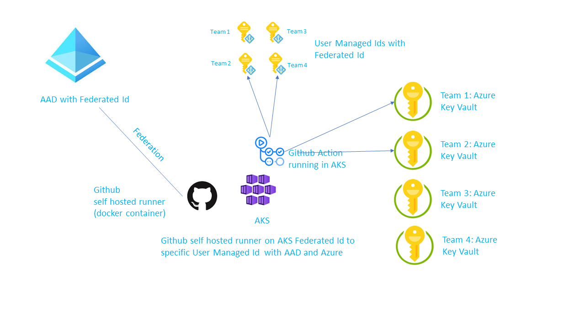


## Setup

We are going to setup Azure Container Apps, AKS, Azure Key Vault with a secret and let a Github Self hosted runner in AKS and Azure Container Apps able to read the secret via the User Managed Identity. 

1. Create an Azure [User Managed Identity](https://learn.microsoft.com/en-us/azure/active-directory/managed-identities-azure-resources/how-manage-user-assigned-managed-identities?pivots=identity-mi-methods-azcli#create-a-user-assigned-managed-identity-1):

    ```sh
    az identity create -g ADO -n umi-github
    ```

    The picture below shows the User Managed Identity created and select the "Federated credentials".
    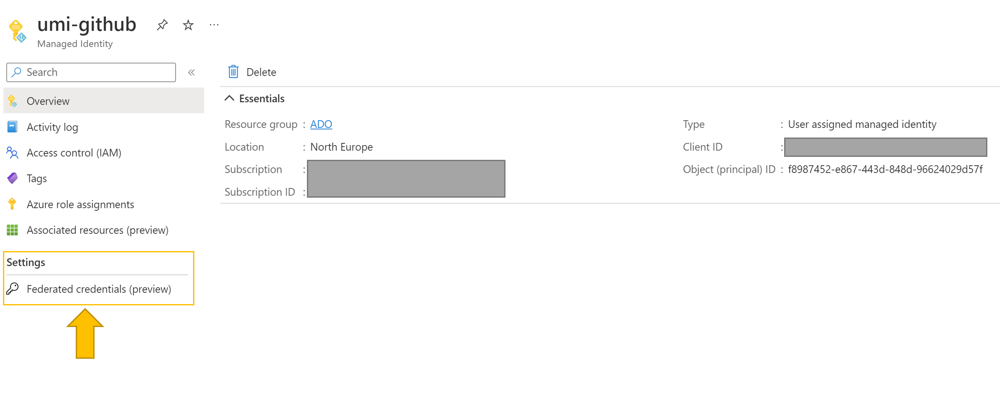

2. Click on the Federated Credentials and then "+Add Credential" and choose "Github Actions to deploy to Azure Resources"


3. Fill in the following from your Github repository
    - Organization: <you github account name>
    - Repository: <your repo>
    - Entity: <we select branch for this example>
    - Branch: <we select main for this example>
    - Name: <just a name>

    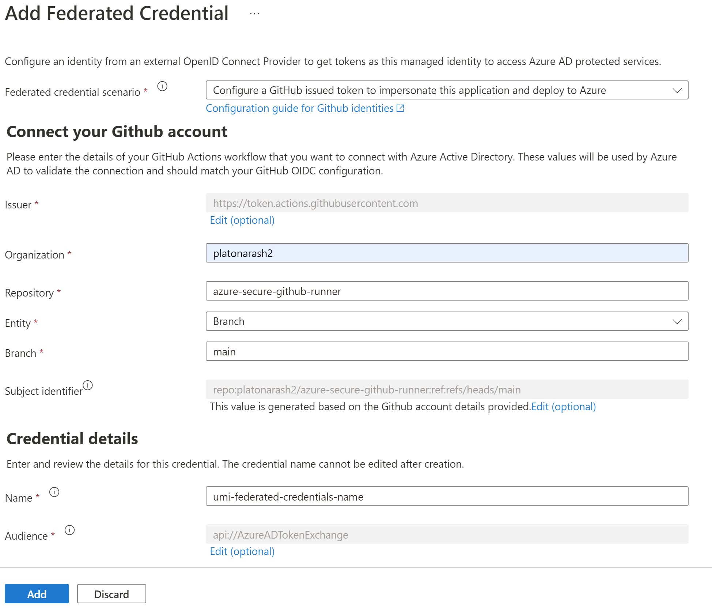

4. Create an Azure Container Registry, https://learn.microsoft.com/en-us/azure/container-registry/container-registry-get-started-azure-cli.

```sh
    az acr create --resource-group ADO \
    --name acrgithubrunner --sku Basic
```      
5. Build the container that can run Github Self hosted runner and import into the Azure Container Registry. This Github Repository contains a preprepared  Dockerfile and script to run your Github Selfhosted runner. They are located [here](https://github.com/platonarash2/azure-secure-github-runner/tree/main/docker).

This will build and push your image into the Azure Container Registry without the need to have docker installed on your client machine, it takes a minute or so.


```sh
cd ./docker
az acr login -n acrgithubrunner
az acr build --image  mygithubrunner:1.0  --registry acrgithubrunner . -f Dockerfile-github-selfhosted-runner

----

> cd docker
> az acr build --image  mygithubrunner:1.0  --registry acrgithubrunner . -f Dockerfile-github-selfhosted-runner
Packing source code into tar to upload...
Uploading archived source code from '/tmp/build_archive_64c2e44cf04a439fade661fe9b53ac1a.tar.gz'...
Sending context (1.120 KiB) to registry: acrgithubrunner...
Queued a build with ID: dt1
Waiting for an agent...
2022/11/28 15:18:36 Downloading source code...
2022/11/28 15:18:37 Finished downloading source code
....
Run ID: dt1 was successful after 3m48s
----
>
```

Check in your Azure Container Registry, your image should be there now.
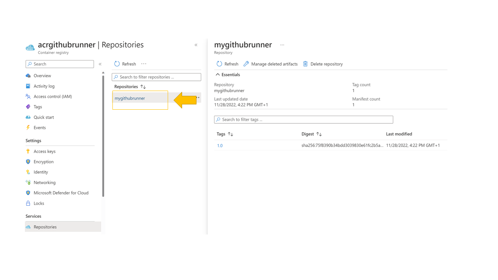

6. Now enable System Managed Identity on the Azure Container Registry so we can use that identity to enable access from our Azure Container App that we are going to create later, please *acrgithubrunner* with the name of your Azure Container Registry.

    ```sh
    az acr identity assign --identities '[system]' --name  acrgithubrunner

    ```

7. Creating the Github Self hosted runner. Go to your Github repository and click on *"New Self Hosted Runner"*, see picture below.
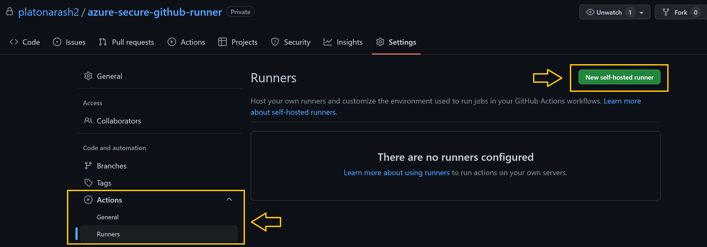

8. Copy the *token* seen in the picture below. The token is generated by Github and is valid for 60 min. It is used to register the self hosted runner so the runner needs to register within 60 min. After the registration has been completed the token is exchanged and not used, e.g. it is not a long lived secret which greatly enhances the security setup of this architecture, more information here https://github.com/actions/runner/blob/main/docs/design/auth.md.
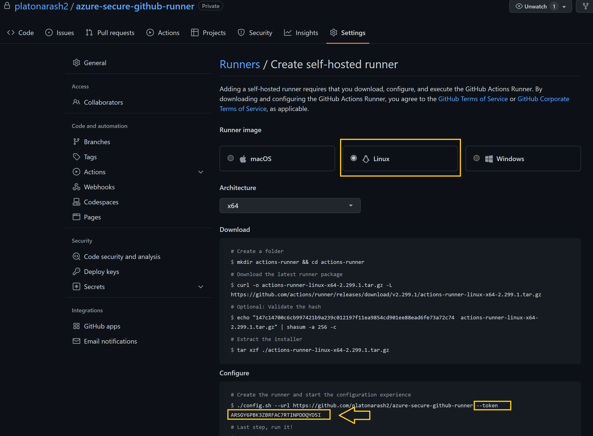

9. Create an Azure Container App Enviroment and Container App; (https://learn.microsoft.com/en-us/azure/container-apps/get-started?tabs=bash).

    - Replace the *acrgithubrunner.azurecr.io* with your registry name that you just built in the previous step.
    - Replace the *TOKEN* variable from the previous step.
    - Replace the *GITHUB* with the URL of your Github Repository.
    - Replace the *NAME* variable with a arbitrary name of your choice, it will be the name of your self hosted runner in Github.  

    ```sh
        az containerapp env create \
            --name githubrunneracaenv \
            --resource-group ADO \
            --location "northeurope"

        az containerapp create \
            --name githubcontainerapp \
            --resource-group ADO \
            --environment githubrunneracaenv \
            --image acrgithubrunner.azurecr.io/mygithubrunner:1.0 \
            --registry-identity 'system' \
            --registry-server acrgithubrunner.azurecr.io \
            --max-replicas 1 \
            --min-replica 1 \
            --env-vars TOKEN="ARSGY6PBK3ZBRFAC7RTINPDDQYD5I" GITHUB="https://github.com/platonarash2/azure-secure-github-runner" NAME="containerapprunner"  
                      
    ```

    This will register the Azure Container App with Github and start the runner. The environment variables are passed into the container at runtime rather than build time. You could enhance the security even further and place the environment variables in Azure Key Vault and create the container app with environment picked up from Azure Key Vault, the keyword would be using *"SECRETENV=secretref:tokensecret"* for example. More information about Azure Container Apps and Key Vault integration exxamples here: https://learn.microsoft.com/en-us/cli/azure/containerapp?view=azure-cli-latest#az-containerapp-create-examples  

10. Go to the Azure Portal and into your resource group and select the Azure Container App that you just created. Select the *Log Stream* seen below and make sure the Container App is connected and registered to Github.
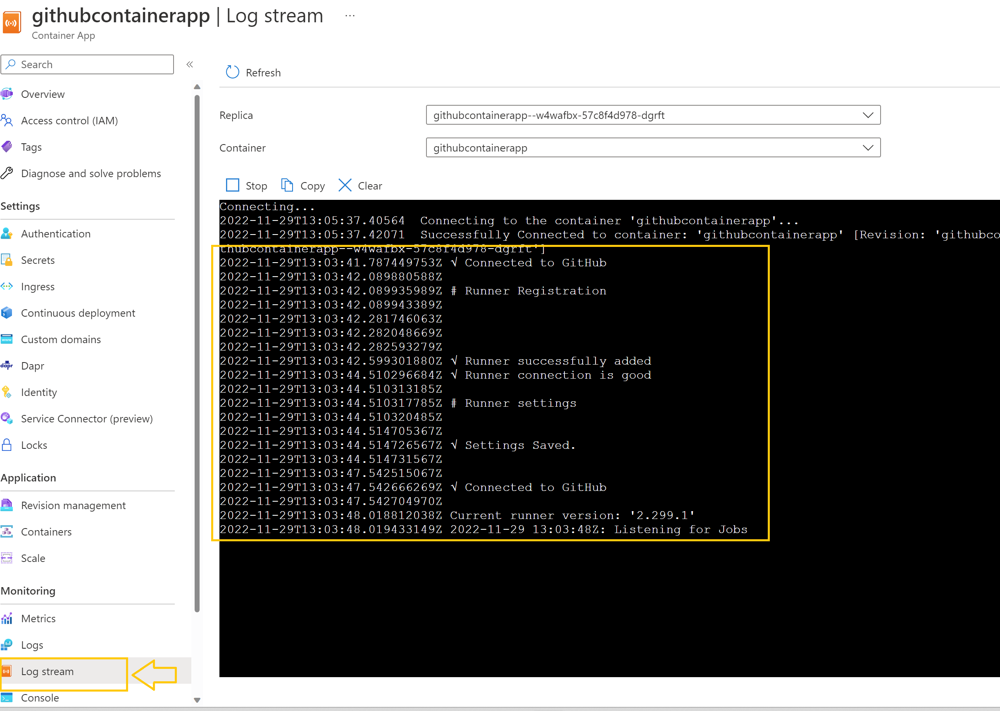

11. Go to Github and check you self hosted runners and you should have your runner registered and green.


12. We are going to use the User Managed Identity created in step 1 to deploy to Azure. To achieve that we need the get the clientId, Subscription Id and tenant Id from Azure. Execture the below CLI will give you these details.

```sh
    >az identity show -g ADO -n umi-github
{
  "clientId": "**************************",
  "id": "/subscriptions/*******************************/resourcegroups/ADO/providers/Microsoft.ManagedIdentity/userAssignedIdentities/umi-github",
  "location": "northeurope",
  "name": "umi-github",
  "principalId": "f8987452-e867-443d-848d-96624029d57f",
  "resourceGroup": "ADO",
  "tags": {},
  "tenantId": "**************************************",
  "type": "Microsoft.ManagedIdentity/userAssignedIdentities"
}

```

13. Go to Github->Secrets->Actions seen below and add the three following secrets (observe that these are not "secret" values since they are not the magic to get the federation happening):
    - AZURE_CLIENT_ID - client Id from below
    - AZURE_SUBSCRIPTION_ID - subscription Id from below
    - AZURE_TENANT_ID - tenant Id from below


14. Go to Github and create a new Action workflow. 

 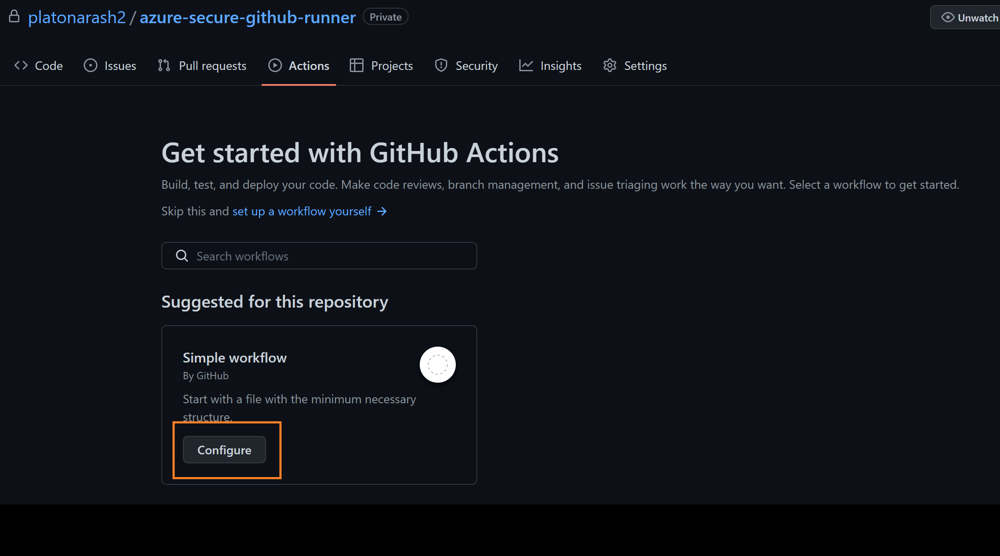

15. Copy the content from .github/workflows/containerappaction.yml in this repository and name the file "containerappaction.yml".

 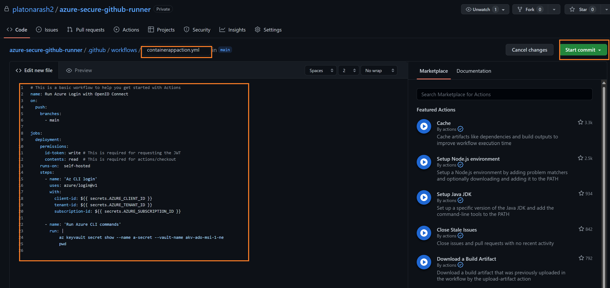

 16. In the containerappaction.yml there is a reference "my-secret-vault" which is a Azure Key Vault that we are targeting for reading the information from a secret named "a-secret". **Now we are going to create an Azure Key Vault and make the User Managed Identity be able to read secrets from the Azure Key Vault**. The User Managed Identity could have any rights you would like it to have to make a successfull deployment in Azure. Note: the name is globally unique so you need to have unique name.

```sh
    az keyvault create \
        --name "my-secret-vault-90" \
        --resource-group ADO \
        --enable-rbac-authorization true\
        --location "northeurope"
```


17. And add a secret into the Azure Key Vault and make the User Managed Identity have access to the key vault as the role "Key Vault Secrets User".

```sh
    # get the user id from current user, we need to add admin access so you can control access to the key vault
    az ad signed-in-user show

    # add your id as Key Vault Secret Officer role to the Key Vault
    az role assignment create \
        --role "Key Vault Secrets Officer" \
        --assignee <id-from-the-cli-above> \
        --scope "/subscriptions/********<you subscription id>********/resourcegroups/ADO/providers/Microsoft.KeyVault/vaults/my-secret-vault-90"

    # add a secret to the vault
    az keyvault secret set \
        --name a-secret --vault-name "my-secret-vault-90" \
        --value "This is a super secret that only the Managed Identity is allowed to read!"

    # get the Id of the user managed Id
    az identity show --name umi-github --resource-group ADO 

    # add the User Managed Identity to have access to the vault, the role "Key Vault Secrets User"
    az role assignment create \
        --role "Key Vault Secrets User" \
        --assignee <CLIENT-ID FROM COMMAND ABOVE> \
        --scope "/subscriptions/********<you subscription id>********/resourcegroups/ADO/providers/Microsoft.KeyVault/vaults/my-secret-vault-90"

```

18. Change the kevault name in the *containerappaction.yml* file to your key vault name. 

19. Commit any file changes to the main branch and watch the runner pick up the job and execute the Azure CLI script in the *containerappaction.yml* file that will read out the secret in the action.

```sh
az keyvault secret show --name a-secret --vault-name my-secret-vault-90
```

Loog into the log of the self hosted runner and see the print out from the Azure CLI script that is reading the secret in the Azure Key Vault! :)

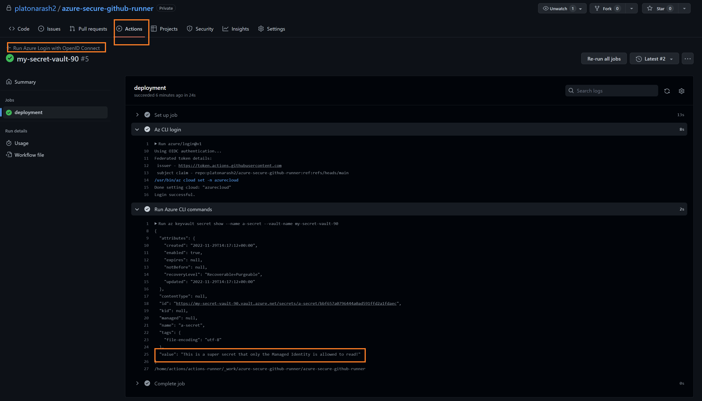

You are finished! 


## AKS Setup
To set this up in Azure Kubernetes Service, AKS, use the supplied manifest in 


1. Setup an AKS cluster: https://learn.microsoft.com/en-us/azure/aks/learn/quick-kubernetes-deploy-cli

2. Then you need to enable the AKS cluster to have access to pull images from the Azure Container Registry above, https://learn.microsoft.com/en-us/azure/aks/cluster-container-registry-integration?tabs=azure-cli#attach-an-acr-to-an-aks-cluster.


```sh
az aks update -n <aks-cluster-name> -g <resource-group-name> --attach-acr <container-registry-name>
```
4. Create a new Github Self hosted runner in Github similar as above, take note of the token. 

3. Change the ./aks/aks-github-runner.yaml file accordingly:

- TOKEN - token from Github self hosted runner just created
- GITHUB - the URL to your repoisitory
- image - the image that you created earlier

4. >kubectl apply -f aks-github-runner.yaml

5. Done!
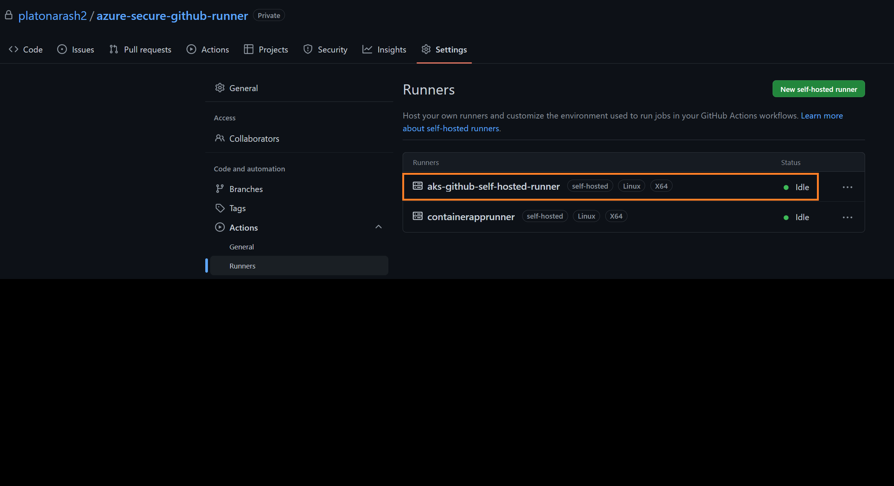


## References

- [Azure Container Apps](https://learn.microsoft.com/en-us/azure/container-apps/overview)
- [Github Self Hosted Runner](https://docs.github.com/en/actions/hosting-your-own-runners/about-self-hosted-runners)
- [AAD federated identity](https://learn.microsoft.com/en-us/cli/azure/identity/federated-credential?view=azure-cli-latest)
- [AKS - Azure Kubernetes Service](https://learn.microsoft.com/en-us/azure/aks/intro-kubernetes)
